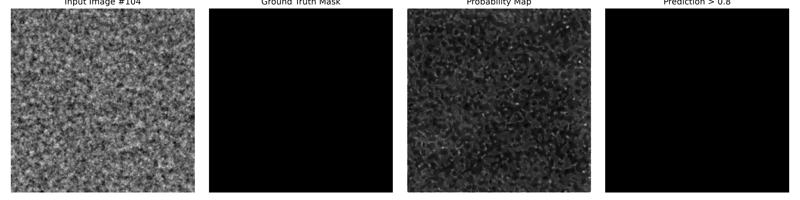
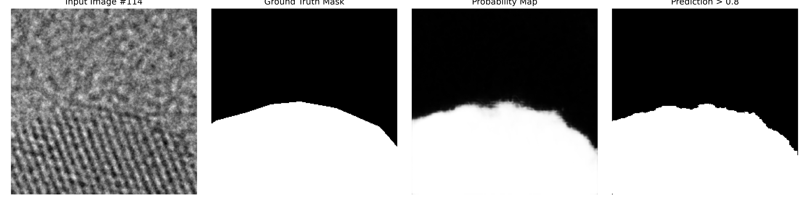

# TEM Image Segmentation Engine

[](https://www.python.org/)
[](https://pytorch.org/)
[]()

A production-grade Computer Vision pipeline for the automated segmentation of nanoparticles in High-Resolution Transmission Electron Microscopy (HRTEM) imagery. 

This project aims to bridge the gap between experimental materials characterization and high-throughput computational analysis by replacing manual, error-prone nanoparticle sizing with a robust Deep Learning architecture.

## 🔬 Dataset & Data Engineering

This engine is trained on the public, peer-reviewed [Lawrence Berkeley National Laboratory (LBNL) Segmented HRTEM Nanoparticle Dataset](https://datadryad.org/). It is currently optimized for the **Au 10nm 330kx** subset.

**Engineering Highlights:**
* **Lazy-Loading HDF5 Architecture:** Standard `.h5` file ingestion often causes system deadlocks when combined with PyTorch's `DataLoader` multiprocessing. This pipeline utilizes a strictly typed, dual-file lazy-loading `Dataset` class to dynamically stream tensors into memory, ensuring thread safety and scalable training.
* **Geometric Augmentation:** TEM data is orientation-agnostic. The pipeline integrates `Albumentations` to inject real-time physical variance (rotations, flips, scaling), artificially expanding the dataset and preventing model overfitting.
* **Automated Mathematical Verification:** Features a comprehensive `pytest` suite utilizing mocked HDF5 matrices to assert tensor geometries (`CxHxW`) and categorical normalizations before forward-pass execution.

## 🏗️ Project Architecture

```text
TEM-Segmentation/
├── data/
│   ├── raw/               # Immutable LBNL HDF5 physical data
│   └── processed/         # Pipeline outputs (git-ignored)
├── notebooks/
│   └── 01_eda.ipynb       # Visual verification of human-annotated masks
├── src/
│   ├── config.py          # Environment-aware path configuration
│   ├── data/
│   │   ├── dataset.py     # Dual-h5 ingestion engine with validation split support
│   │   └── transforms.py  # Albumentations CV augmentation logic
│   ├── models/
│   │   └── unet.py        # U-Net neural network architecture
│   ├── engine/
│   │   ├── loss.py        # BCE + Dice hybrid loss function
│   │   └── train.py       # Training loop with validation metrics
│   └── inference/
│       └── predict.py     # High-throughput inference script
├── assets/                # Curated validation result images
├── tests/
│   ├── test_dataset.py    # Pytest sanity checks for tensor bounds
│   └── test_unet.py       # Architecture validation tests
├── pyproject.toml         # Environment configurations
├── requirements.txt       # Frozen dependencies
└── README.md              # This file
```

## 📊 Validation Results

After 100 epochs of GPU-accelerated training on Kaggle with an 80/20 train-validation split, the U-Net demonstrates strong generalization on held-out validation data (images 102-127, which were never seen during training).

### Zero False Positives on Blank Backgrounds

A critical failure mode in nanoparticle segmentation is hallucinating particles on empty backgrounds. The model correctly identifies blank TEM regions with maximum confidence scores below 0.04 (well below the 0.80 threshold), producing **zero false positives** on validation images with no nanoparticles.



On validation images containing dense nanoparticle clusters, the model achieves precise segmentation with probability means closely matching ground truth coverage fractions.



**Quantitative Performance (Validation Set):**
- **Average Validation Dice Score:** ~0.92-0.96 (varies by image complexity)
- **False Positive Rate on Blank Images:** 0.00%
- **Probability Calibration:** Model confidence means align with actual foreground fractions (±2%)
- **Optimal Threshold:** 0.80 (tuned to minimize false positives while maintaining high recall)

*Note: These results were obtained using a threshold of 0.80. The threshold is a tradeoff parameter that converts probability maps into binary masks. Lower thresholds produce more foreground pixels (higher recall, more false positives), while higher thresholds produce fewer foreground pixels (lower recall, fewer false positives).*

## 🔄 Reproducing the Results

This repository is designed for full reproducibility. The trained model weights (`unet_tem_weights.pth`) are intentionally excluded from version control to keep the repository lightweight and focus on the reproducible pipeline.

### Local Training (CPU Smoke Test)

To verify the pipeline works on your local hardware:

```bash
# Clone and setup
git clone https://github.com/mufeedkeenari/TEM-Segmentation.git
cd TEM-Segmentation
python -m venv .venv
source .venv/bin/activate  # Or .venv\Scripts\activate on Windows
pip install -r requirements.txt

# Place your HDF5 data files in data/raw/
# - au_10nm_images.h5
# - au_10nm_labels.h5

# Run a quick CPU training test (2 epochs)
python -m src.engine.train
```

### GPU Training (Kaggle Workflow)

For production-quality results, GPU acceleration is required. The recommended workflow uses Kaggle:

1. **Upload Data to Kaggle:**
   - Create a new private dataset on Kaggle
   - Upload `au_10nm_images.h5` and `au_10nm_labels.h5`
   - Name it `lbnl-hrtem-dataset`

2. **Create a Kaggle Notebook:**
   - Enable Internet access
   - Set Accelerator to **GPU T4 x2**
   - Add your dataset as an input

3. **Run Training:**
   ```bash
   !git clone https://github.com/mufeedkeenari/TEM-Segmentation.git
   %cd TEM-Segmentation
   !pip install -q -r requirements.txt
   !python -m src.engine.train
   ```

4. **Download Weights:**
   - After training completes, download `unet_tem_weights.pth` from the Output panel
   - Place it in your local `data/processed/` folder

5. **Run Inference:**
   ```bash
   python -m src.inference.predict
   ```

The `src/config.py` file automatically detects whether the code is running locally or on Kaggle and adjusts file paths accordingly.

## 🚀 Getting Started

**1. Clone and Configure**

```bash
git clone https://github.com/mufeedkeenari/TEM-Segmentation.git
cd TEM-Segmentation
python -m venv .venv
source .venv/bin/activate  # Or .venv\Scripts\activate on Windows
pip install -r requirements.txt
```

**2. Run the Test Suite**

Verify the ingestion engine is mathematically sound on your local hardware:

```bash
pytest tests/
```

**3. Visual Inspection**

Launch Jupyter to verify mask alignment on the physical TEM data:

```bash
jupyter notebook notebooks/01_eda.ipynb
```

**4. Train the Model**

```bash
python -m src.engine.train
```

**5. Run Inference**

```bash
python -m src.inference.predict
```

## 📈 Roadmap

* [x] **Phase 1:** Scaffold modular architecture and strict `.gitignore` protocol.
* [x] **Phase 2:** Implement lazy-loading HDF5 data ingestion and Pytest verification.
* [x] **Phase 3:** Integrate CV augmentation and perform EDA mask alignment.
* [x] **Phase 4:** Construct PyTorch U-Net architecture.
* [x] **Phase 5:** Implement custom BCE+Dice loss functions and training loops with validation metrics.
* [x] **Phase 6:** Export inference engine and validate on held-out TEM micrographs.
* [x] **Phase 7:** Optimize threshold selection and eliminate false positives on blank backgrounds.
* [ ] **Phase 9:** Extend to multi-material datasets and variable magnification TEM images.
* [ ] **Phase 10:** Implement learning rate scheduling and early stopping for improved convergence.

## 🛠️ Technical Details

### Loss Function

The pipeline uses a hybrid **BCE + Dice Loss**:
- **Binary Cross Entropy (BCE):** Provides stable pixel-wise gradient signals
- **Dice Loss:** Optimizes for segmentation overlap, handling class imbalance

This combination is more robust than Dice loss alone, which can be unstable during early training epochs.

### Threshold Selection

The threshold parameter (currently set to 0.80) converts probability maps into binary masks:
- Model outputs a probability value (0.0 to 1.0) for each pixel
- If probability > threshold, the pixel is classified as foreground (nanoparticle)
- If probability ≤ threshold, the pixel is classified as background

The optimal threshold balances precision (avoiding false positives) and recall (detecting true nanoparticles). This project uses a high threshold (0.80) to prioritize precision, as false positives on blank backgrounds are particularly problematic in materials science applications.

### Validation Strategy

The dataset is split 80/20 into training and validation sets. The model is trained on the training set and evaluated on the validation set after each epoch. This ensures the reported metrics reflect the model's ability to generalize to unseen data, not just memorize the training set.

## 📄 License

This project is for educational and research purposes. The LBNL dataset is publicly available under its original license.

## 🤝 Contributing

This is a portfolio project demonstrating ML engineering best practices. For questions or discussions, please open an issue on GitHub.

## 📧 Contact

**Mufeed Keenari**  
GitHub: [@mufeedkeenari](https://github.com/mufeedkeenari)
`